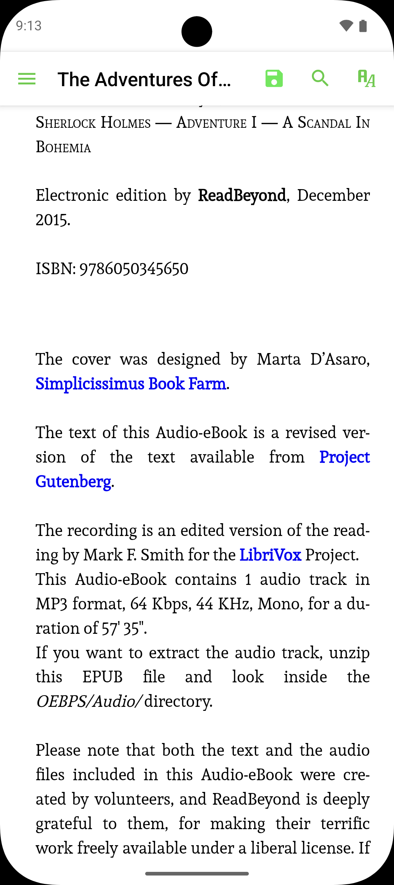
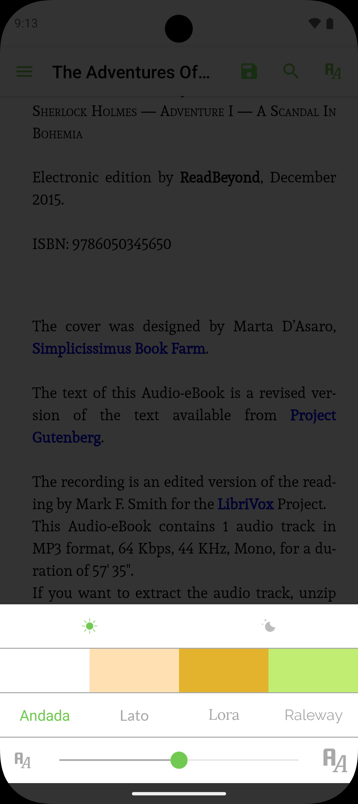

# @kakha13/epub-reader

NativeScript plugin for reading EPUB files on iOS and Android. This plugin uses custom updated packages for both platforms.

```bash
npm install @kakha13/epub-reader
```

[](https://www.buymeacoffee.com/kakha13)

## Underlying Packages

This plugin uses updated versions of FolioReader libraries:

- **iOS**: [FolioReaderKitEpub](https://github.com/kakha13/FolioReaderKitEpub) - A Swift ePub reader and parser framework for iOS
- **Android**: [FolioReader-Android](https://github.com/kakha13/FolioReader-Android) - An EPUB reader written in Java and Kotlin

## Screenshots

### iOS

<div style="display: flex; gap: 10px; flex-wrap: wrap;">
  
  
</div>

### Android

<div style="display: flex; gap: 10px; flex-wrap: wrap;">
  
  
</div>

## Usage

You can open EPUB files from either the app bundle (relative path) or from anywhere on the device (absolute path):

### Opening from App Bundle

```ts
import { EpubReader } from '@kakha13/epub-reader';

const reader = new EpubReader();

// Open from app bundle (relative path)
reader.open('books/sample.epub');
```

### Downloading and Opening EPUB Files

```ts
import { EpubReader } from '@kakha13/epub-reader';
import { Http, knownFolders } from '@nativescript/core';

const reader = new EpubReader();

// Download and store EPUB file
const tempFolder = knownFolders.temp().getFolder('books.temp/');
const url = 'https://example.com/book.epub';
const fileName = url.split('/').pop();

Http.getFile(url, `${tempFolder.path}/${fileName}`)
  .then(file => {
    // Open using absolute path
    reader.open(file.path);
  })
  .catch(error => {
    console.error('Download failed:', error);
  });
```

## Notes

- Supports both **iOS** and **Android** platforms.
- **iOS**: The plugin declares a CocoaPods dependency on `FolioReaderKit` from [FolioReaderKitEpub](https://github.com/kakha13/FolioReaderKitEpub) (branch `master`); it is bundled automatically via the plugin Podfile. If you maintain a custom App_Resources Podfile, ensure this pod remains included.
- **Android**: The plugin uses [FolioReader-Android](https://github.com/kakha13/FolioReader-Android) via JitPack (version 4). The dependency is automatically included via the plugin's `include.gradle` file.
- Methods throw if the epub file cannot be found or there is no active page to present from, to make integration failures visible.

## License

Apache License Version 2.0
